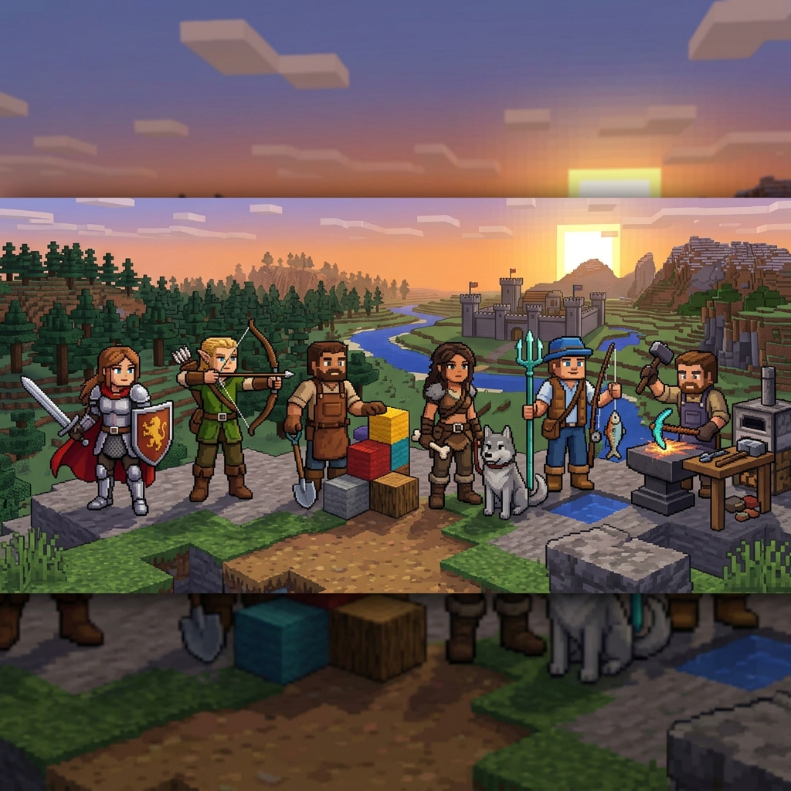
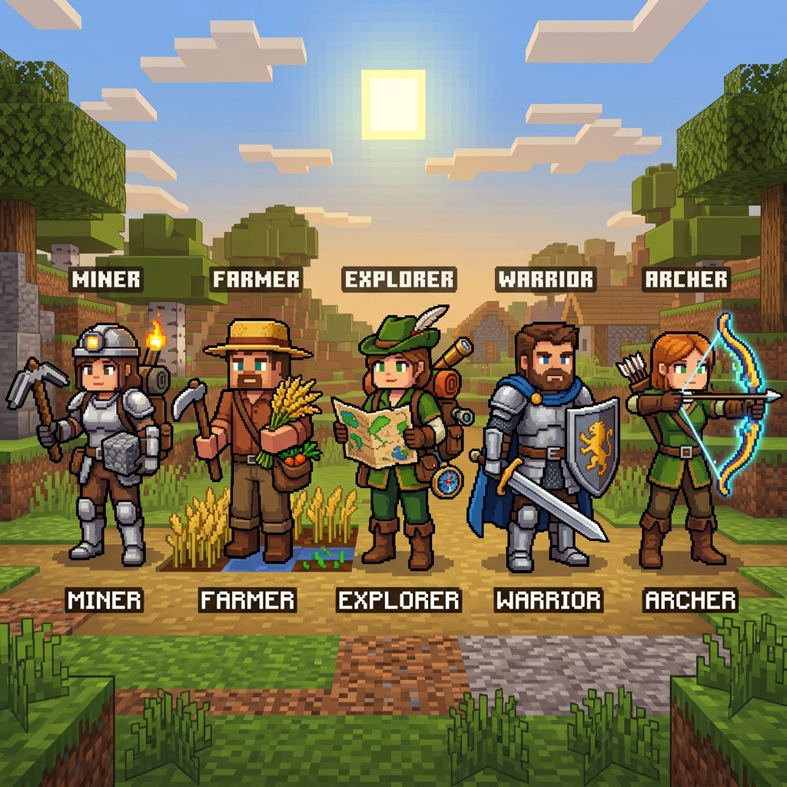
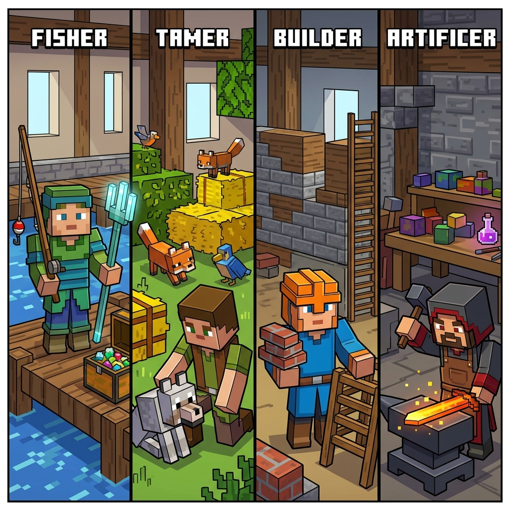
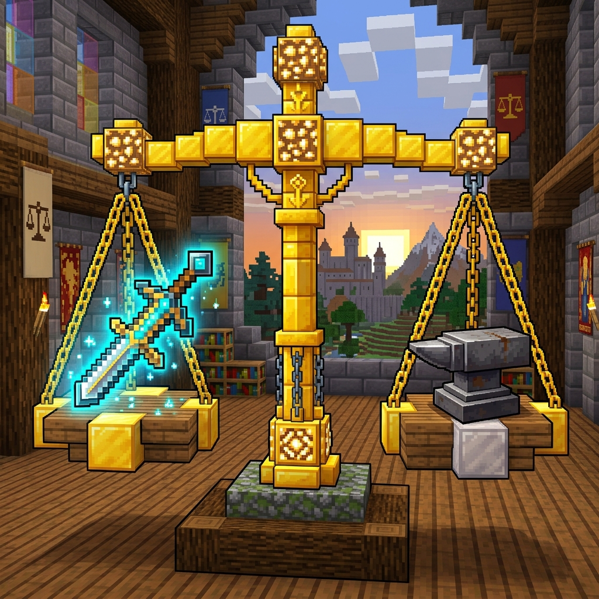
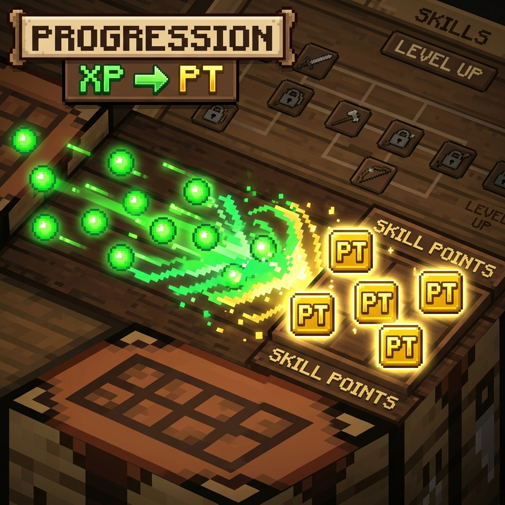
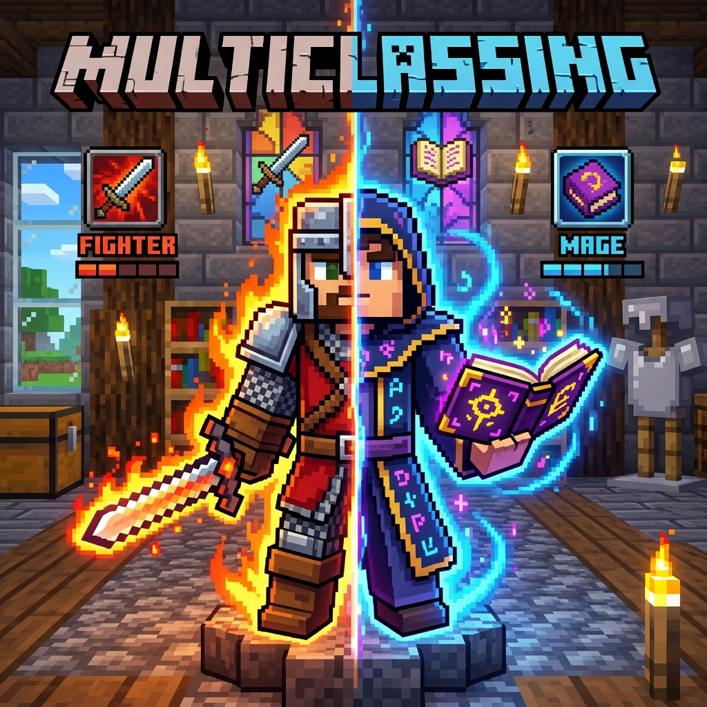

# Talents & Vocations

## Objetivo
O **Talents & Vocations** é um mod para Minecraft focado em expandir a progressão do jogador através de um sistema de árvores de talentos. O objetivo é oferecer uma experiência de RPG imersiva mantendo a essência "vanilla", permitindo aos jogadores investir seus níveis de experiência (XP) na compra de Pontos de Talento (PT) para desbloquear habilidades e buffs exclusivos para se adaptar ao seu estilo de jogo.

## O Que Foi Implementado na V2

- **Árvores de Talentos Customizadas:** 10 árvores completas contendo no total 145 nós.
- **Sistema de Progressão (XP para PT):** Os jogadores convertem níveis de XP diretamente em Pontos de Talento através da interface.
- **Classes Especializadas:** 9 classes principais voltadas para diferentes estilos de jogo e 1 árvore "Comum" focada em sobrevivência.
- **Multiclasse (Segunda Vocação):** Possibilidade de desbloquear e equipar uma classe secundária simultaneamente.
- **Interface Intuitiva (GUI):** Telas dedicadas com abas para visualização da árvore de talentos, compra de nós, verificação de requisitos e gerenciamento do perfil.
- **Sistema de Respec:** Capacidade de reverter as escolhas de classe independentes, recuperando parte dos Pontos de Talento gastos.

## Classes Disponíveis

O mod agora possui 9 classes principais e 1 árvore de sobrevivência universal:

1. 🌳 **Comum (Sobrevivência)**: *Sempre ativa para todos os jogadores e não é afetada por mudanças de classe.* (Aumento de vida, fôlego e resistência).
2. ⛏️ **Minerador**: Quebra mais rápida de blocos, minérios extras e visão no escuro.
3. 🌾 **Produtor (Fazendeiro)**: Colheita em área, drops extras de pecuária e aura de crescimento rápido.
4. 🧭 **Desbravador**: Mobilidade, redução de dano de queda e diminuição da exaustão (fome) ao correr.
5. ⚔️ **Guerreiro**: Combate corpo a corpo, dano com espadas/machados, repulsão e resistência a danos corporais.
6. 🏹 **Arqueiro**: Combate à distância, puxada rápida, e chance de poupar flechas.

### 🌟 Novas Classes (A partir da v2.0.0)

7. 🔱 **Pescador / Navegante**: Especialista do oceano. Ganha bônus de pesca rápida, barco acelerado e aumento de dano usando Tridente.
8. 🐺 **Domador**: Mestre das feras. Concede bônus passivos de vida/dano e utilidade para lobos, cavalos, golens e gatos.
9. 🧱 **Construtor**: Focado em blocos baratos e construção ágil. Alcance extra e economia de materiais na construção e andaimes.
10. 🔨 **Artífice**: Otimização na bigorna, reparo mais eficiente e encantamento facilitado.

## Resumo dos Buffs e Balanceamento (V2)

Para garantir que o acúmulo de duas classes (Multiclasse) não quebre o jogo, o sistema é estritamente balanceado:
- **Encantamentos**: Bônus percentuais do mod são aplicados *depois* e *multiplicativamente* aos encantamentos vanilla.
- **Limites de Combate**: No máximo **50% de redução de dano** em combate.
- **Dano de Queda e Durabilidade**: Teto de 60% de mitigação para quedas e máximo de 50% de chance global de poupar durabilidade de ferramentas.

## Como Funciona a Compra de Pontos (PT)

- **Conversão Base**: A cada **5 Níveis de XP** normais, você pode convertê-los em **1 Ponto de Talento (PT)** através da interface do mod.
- Ao clicar em um nó na árvore de sua classe, você verá os requisitos. Se possuir PTs e cumprir os requisitos, o talento pode ser desbloqueado.

## Mudança de Classes e Multiclasse

**Escolha Inicial e Respec (Troca de Classe):**
- A primeira escolha de classe do jogador é totalmente gratuita.
- Caso deseje mudar, é possível realizar a troca de classe na aba dedicada pagando uma taxa em níveis de XP.
- O mod devolve **25%** dos PT (Pontos de Talento) já gastos naquela classe, permitindo um "re-start" acelerado.
- A sua **Árvore Comum (Sobrevivência) nunca sofre reset**, mantendo seu progresso base intacto!

**Multiclasse (Segunda Vocação):**
- Jogadores que atingirem o **"capstone"** (nó final) da classe primária podem comprar a habilidade `Segunda Vocação` (na árvore Comum), liberando um espaço para uma classe Secundária.
- Ambas evoluem simultaneamente. Contudo, a classe secundária tem sua árvore inteira disponível **exceto** o capstone, que é benefício exclusivo da classe principal.
