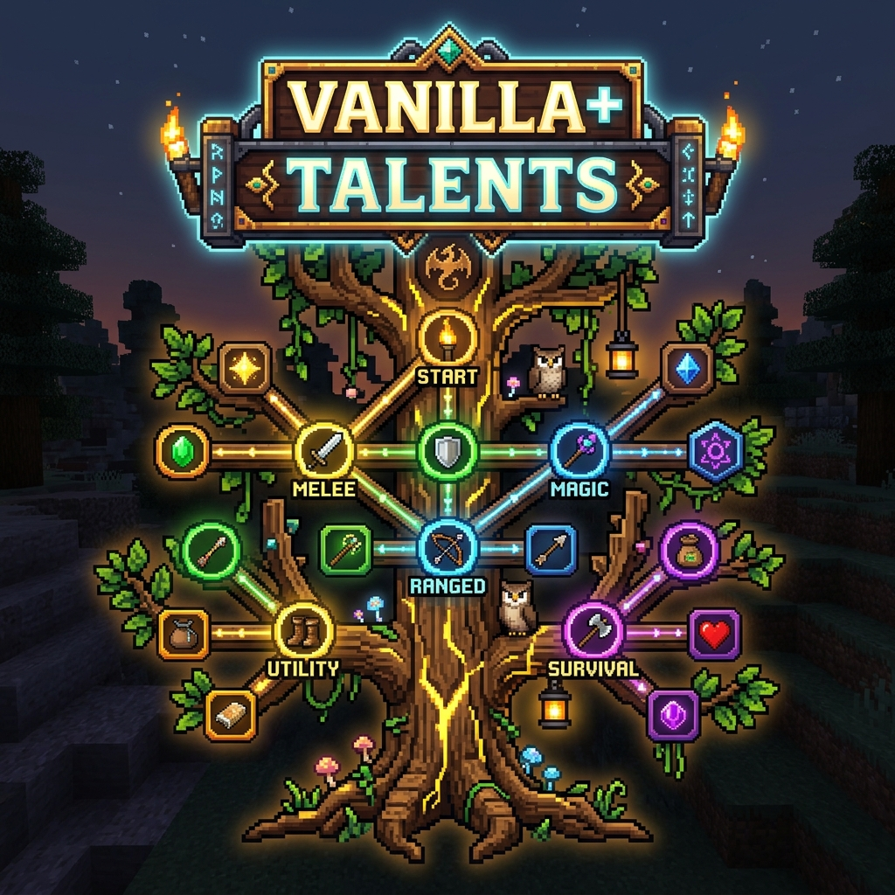
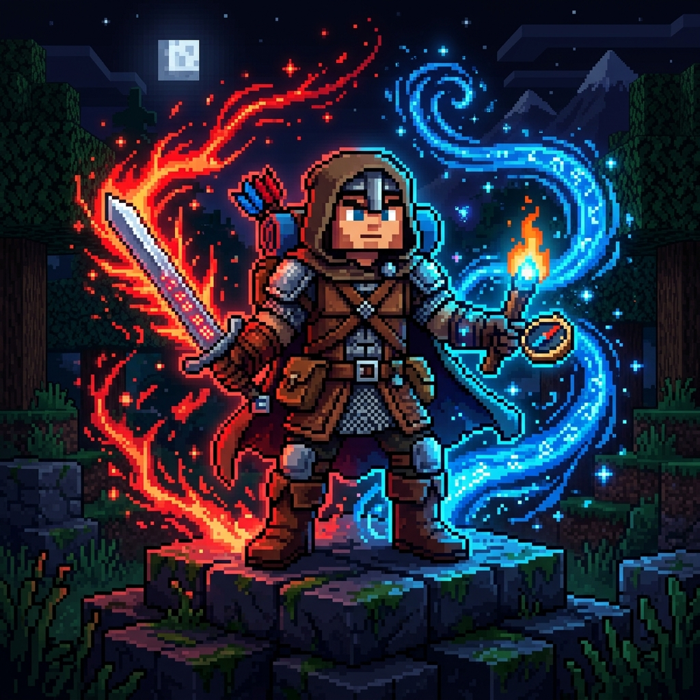

# Vanilla+ Talents

## Objetivo
O **Vanilla+ Talents** é um mod para Minecraft focado em expandir a progressão do jogador através de um sistema de árvores de talentos. O objetivo é oferecer uma experiência de RPG imersiva mantendo a essência "vanilla", permitindo aos jogadores investir seus níveis de experiência (XP) na compra de Pontos de Talento (PT) para desbloquear habilidades e buffs exclusivos para se adaptar ao seu estilo de jogo.

## O Que Foi Implementado
- **Árvores de Talentos Customizadas:** 6 árvores completas contendo no total 96 nós (16 nós e caminhos progressivos por árvore).
- **Sistema de Progressão (XP para PT):** Os jogadores convertem níveis de XP diretamente em Pontos de Talento através da interface.
- **Classes Especializadas:** 5 classes principais voltadas para diferentes estilos de jogo e 1 árvore "Comum" focada em sobrevivência.
- **Multiclasse (Segunda Vocação):** Possibilidade de desbloquear e equipar uma classe secundária simultaneamente.
- **Interface Intuitiva (GUI):** Telas dedicadas para visualização da árvore de talentos, compra de nós, verificação de requisitos e gerenciamento do perfil do jogador.
- **Sistema de Respec:** Capacidade de reverter as escolhas de classe recuperando parte dos Pontos de Talento gastos.

## Classes Disponíveis

O mod possui 5 classes principais e 1 árvore de sobrevivência universal:

1. 🌳 **Comum (Sobrevivência)**: *Sempre ativa para todos os jogadores e não é afetada por mudanças de classe.*
   - **Foco**: Melhorias universais.
   - **Buffs**: Aumento de vida, regeneração, diminuição da fome, aumento de fôlego e resistência a fogo.

2. ⛏️ **Minerador**:
   - **Foco**: Especialista do subterrâneo e extração.
   - **Buffs**: Quebra mais rápida de blocos e pedras (Braços Incansáveis), minérios extras (efeito similar à Fortuna) e visão no escuro nas profundezas.

3. 🌾 **Produtor (Fazendeiro)**:
   - **Foco**: Agricultura e pecuária.
   - **Buffs**: Colheita em área, drops extras ao abater animais e uma aura passiva que acelera o crescimento das suas plantações.

4. 🧭 **Desbravador**:
   - **Foco**: Exploração e mobilidade pelo mundo.
   - **Buffs**: Aumento da velocidade de movimento, redução substancial de dano de queda e diminuição da exaustão (fome) ao correr pelo mapa.

5. ⚔️ **Guerreiro**:
   - **Foco**: Combate corpo a corpo.
   - **Buffs**: Dano bônus passivo com espadas e machados, maior repulsão nos inimigos e aumento da resistência geral a danos corporais.

6. 🏹 **Arqueiro**:
   - **Foco**: Combate à distância.
   - **Buffs**: Puxada e recarga de arcos e bestas mais rápidas, dano extra em projéteis em geral e chance de recuperar ou poupar flechas ao atirar.

## Resumo dos Buffs (Empilhamento)
Os bônus de combate, durabilidade e resistência oferecidos pelas classes não sobrescrevem e nem invalidam as mecânicas normais do Minecraft.
- **Encantamentos**: Os bônus percentuais do mod são aplicados *depois* dos encantamentos vanilla.
- **Multiplicativo**: Eles se acumulam de forma multiplicativa com as mecânicas base. Isso garante o balanceamento do jogo, impedindo que a soma de reduções de dano ou preservação de durabilidade chegue a 100%.

## Como Funciona a Compra de Pontos (PT)

- Para evoluir, você precisa usar níveis de experiência (XP) normais ganhos no Minecraft.
- **Conversão Base**: A cada 5 Níveis de XP, você pode convertê-los em **1 Ponto de Talento (PT)** através da interface (GUI) do mod.
- Ao clicar em um nó na árvore de sua classe, você verá os requisitos. Se possuir PTs suficientes e cumprir os pré-requisitos lógicos da árvore (como possuir o nó anterior), o talento pode ser desbloqueado.

## Mudança de Classes e Multiclasse

**Escolha Inicial e Respec (Troca de Classe):**
- A primeira escolha de classe do jogador é totalmente gratuita.
- Caso deseje mudar de estratégia, é possível realizar a troca de classe na aba dedicada. Há uma taxa em níveis de XP para realizar o "Respec".
- Ao confirmar a troca, o mod devolve **25%** dos PT (Pontos de Talento) já gastos naquela classe, permitindo um "re-start" acelerado.
- A sua **Árvore Comum (Sobrevivência) nunca sofre reset**, mantendo todo o seu progresso base intacto!

**Multiclasse (Segunda Vocação):**
- Jogadores avançados que atingirem o **"capstone"** (nó final) da sua classe primária e comprarem a habilidade `Segunda Vocação` (na árvore Comum) liberam um slot para uma classe Secundária.
- A classe secundária evolui simultaneamente à primária, concedendo os buffs ao jogador. Contudo, para manter o equilíbrio, a classe secundária não se beneficia do "capstone" de sua própria árvore.
