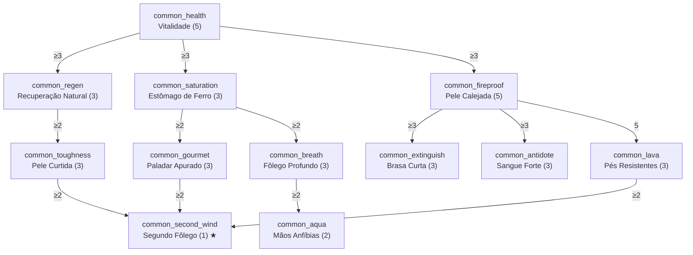

# Árvore Comum — Sobrevivência

- **`treeCategory`:** `common`
- **Disponibilidade:** sempre ativa, para todos os jogadores; **não** é afetada pelo respec.
- **Identidade:** melhorias universais de sobrevivência que qualquer jogador aproveita: vida, fome, fôlego e resistência a fogo.
- **Fora do escopo de propósito:** velocidade de movimento e redução de dano de queda ficam **exclusivamente** com o Desbravador, para não esvaziar a classe.

## Diagrama

## Nós

### Raiz

| ID | Nome | Efeito por nível | Max | Pré-requisitos |
|---|---|---|---|---|
| `common_health` | Vitalidade | +2 de Vida Máxima (1 coração) | 5 | — |

### Ramo Vitalidade

| ID | Nome | Efeito por nível | Max | Pré-requisitos |
|---|---|---|---|---|
| `common_regen` | Recuperação Natural | Regeneração natural (fome ≥ 18) ocorre 10% mais rápido | 3 | `common_health` ≥ 3 |
| `common_toughness` | Pele Curtida | +1 de Armadura | 3 | `common_regen` ≥ 2 |

### Ramo Sustento

| ID | Nome | Efeito por nível | Max | Pré-requisitos |
|---|---|---|---|---|
| `common_saturation` | Estômago de Ferro | −10% de exaustão gerada pela regeneração natural de vida | 3 | `common_health` ≥ 3 |
| `common_gourmet` | Paladar Apurado | Comida concede +10% de saturação | 3 | `common_saturation` ≥ 2 |
| `common_breath` | Fôlego Profundo | +20% de ar máximo debaixo d'água | 3 | `common_saturation` ≥ 2 |
| `common_aqua` | Mãos Anfíbias | −25% da penalidade de mineração submersa (nível 2 ≈ Afinidade Aquática parcial) | 2 | `common_breath` ≥ 2 |

### Ramo Resiliência

| ID | Nome | Efeito por nível | Max | Pré-requisitos |
|---|---|---|---|---|
| `common_fireproof` | Pele Calejada | −6% de dano de fogo (fogo, queimadura, magma) | 5 | `common_health` ≥ 3 |
| `common_extinguish` | Brasa Curta | −15% de duração do estado "em chamas" | 3 | `common_fireproof` ≥ 3 |
| `common_antidote` | Sangue Forte | −10% de duração de Veneno e Fome (efeito) | 3 | `common_fireproof` ≥ 3 |
| `common_lava` | Pés Resistentes | −8% adicional de dano de lava | 3 | `common_fireproof` = 5 |

### Capstone

| ID | Nome | Efeito | Max | Pré-requisitos |
|---|---|---|---|---|
| `common_second_wind` | Segundo Fôlego ★ | Ao ficar com ≤ 4 de vida (2 corações), recebe Regeneração II por 4 s. Recarga de 5 min. | 1 | `common_toughness` ≥ 2, `common_gourmet` ≥ 2, `common_lava` ≥ 2 |

## Custo e balanceamento

| Ramo | PT |
|---|---|
| Raiz | 5 |
| Vitalidade | 6 |
| Sustento | 11 |
| Resiliência | 14 |
| Capstone | 1 |
| **Total** | **37 PT = 185 níveis de XP** |

**Riscos e decisões:**
- **Árvore universal forte demais?** Completa, a Comum dá +10 de vida, +3 de armadura e −30% de fogo para *qualquer* classe. É aceitável porque custa 185 níveis, mas se o early game ficar fácil, comece cortando `common_toughness` (armadura é o atributo mais "seco").
- **Fogo + lava:** em lava, `common_fireproof` (30%) e `common_lava` (24%) se aplicam juntos. Multiplicativamente: 1 − 0,70 × 0,76 ≈ **47%** de redução, antes de Proteção contra Fogo. Não chega à imunidade, mas com Proteção contra Fogo IV dá para andar alguns segundos em lava. Validar no playtest; se ficar trivial, limitar `common_lava` a 2 níveis.
- **`common_saturation` (MVP):** o plano de ação descreve "reduz a velocidade com que a fome desce ao curar vida". Aqui isso foi traduzido para "−exaustão da regeneração natural", que é o mecanismo vanilla real (6.0 de exaustão por ponto curado).
- **Segundo Fôlego:** o único efeito com recarga da árvore; precisa ser salvo no `PlayerSkillData` (ou como tag do jogador) para não ser zerado ao relogar.
- **`common_aqua` vs. Afinidade Aquática:** não aplicar o bônus se o capacete já tiver o encantamento (não somar).
