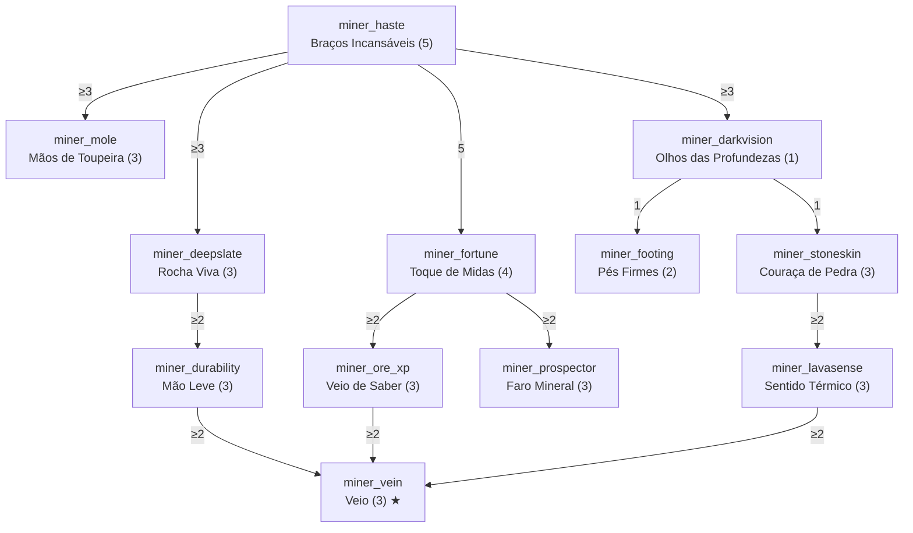

# Classe: Minerador — Subterrâneo e Extração

- **`treeCategory`:** `miner`
- **Identidade:** quem passa horas no subsolo. Quebra pedra mais rápido, tira mais dos minérios e sobrevive melhor nas profundezas.
- **Nós do MVP preservados:** `miner_haste`, `miner_darkvision` e `miner_fortune` mantêm IDs, valores e requisitos do plano de ação.

## Diagrama

## Nós

### Raiz

| ID | Nome | Efeito por nível | Max | Pré-requisitos |
|---|---|---|---|---|
| `miner_haste` | Braços Incansáveis | +10% de velocidade de quebra com picareta | 5 | — |

### Ramo Escavação

| ID | Nome | Efeito por nível | Max | Pré-requisitos |
|---|---|---|---|---|
| `miner_deepslate` | Rocha Viva | +15% adicional de velocidade em deepslate, tufo, basalto e blackstone | 3 | `miner_haste` ≥ 3 |
| `miner_mole` | Mãos de Toupeira | +10% de velocidade de quebra com pá (terra, cascalho, areia, argila) | 3 | `miner_haste` ≥ 3 |
| `miner_durability` | Mão Leve | 8% de chance de picareta/pá não perder durabilidade | 3 | `miner_deepslate` ≥ 2 |

### Ramo Prospecção

| ID | Nome | Efeito por nível | Max | Pré-requisitos |
|---|---|---|---|---|
| `miner_fortune` | Toque de Midas | 5% de chance de drop extra em minérios (acumula com Fortuna) | 4 | `miner_haste` = 5 |
| `miner_ore_xp` | Veio de Saber | +10% de XP de minérios (carvão, lápis-lazúli, redstone, diamante, esmeralda, quartzo) | 3 | `miner_fortune` ≥ 2 |
| `miner_prospector` | Faro Mineral | Agachado e parado por 2 s, minérios num raio de 2/4/6 blocos ficam com contorno colorido por tipo, visível através das paredes, por 3 s. Recarga de 10 s. | 3 | `miner_fortune` ≥ 2 |

### Ramo Profundezas

| ID | Nome | Efeito por nível | Max | Pré-requisitos |
|---|---|---|---|---|
| `miner_darkvision` | Olhos das Profundezas | Visão Noturna contínua enquanto Y < 0 | 1 | `miner_haste` ≥ 3 |
| `miner_footing` | Pés Firmes | −50% da penalidade de quebrar blocos sem estar no chão (escadas, andaimes, nadando) | 2 | `miner_darkvision` = 1 |
| `miner_stoneskin` | Couraça de Pedra | −8% de dano de explosão e de blocos caindo | 3 | `miner_darkvision` = 1 |
| `miner_lavasense` | Sentido Térmico | Ao tocar lava em Y < 0, recebe Resistência ao Fogo por 3 s. Recarga de 90/60/30 s. | 3 | `miner_stoneskin` ≥ 2 |

### Capstone

| ID | Nome | Efeito | Max | Pré-requisitos |
|---|---|---|---|---|
| `miner_vein` | Veio ★ | Agachado, quebrar um minério quebra também até 4/8/12 minérios **do mesmo tipo** conectados. Cada bloco extra gasta durabilidade e exaustão normalmente. | 3 | `miner_durability` ≥ 2, `miner_ore_xp` ≥ 2, `miner_lavasense` ≥ 2 |

## Custo e balanceamento

| Ramo | PT |
|---|---|
| Raiz | 5 |
| Escavação | 9 |
| Prospecção | 10 |
| Profundezas | 9 |
| Capstone | 3 |
| **Total** | **36 PT = 180 níveis de XP** |

**Riscos e decisões:**
- **Velocidade com Eficiência V + Pressa II:** `miner_haste` (+50%) e `miner_deepslate` (+45%) somados a Eficiência V e Sinalizador de Pressa II já chegam a *instamine* de pedra comum. Isso é esperado no late game vanilla, mas o deepslate também ficaria instantâneo. Sugestão: aplicar os bônus como multiplicadores e limitar o deepslate a nunca ficar abaixo de 2 ticks.
- **`miner_fortune` só dispara em minérios que dropam item** (não em minério com Toque Suave). Aplicar **depois** da Fortuna: rolar o drop vanilla e, com 5–20% de chance, duplicar o resultado. **Decisão em aberto:** incluir minérios de ferro, ouro e cobre (que dropam material bruto)? Recomendo que sim, pois é o principal atrativo da classe.
- **Loop de XP:** `miner_ore_xp` aumenta XP, que compra PT. +30% de XP de minério é pouco no total, mas se o playtest mostrar farm de quartzo no Nether como fonte de PT, restringir ao Overworld.
- **Veio (capstone):** é o nó mais caro em performance. Usar busca em largura com limite de blocos, só no servidor, e disparar apenas em blocos com a tag de minério (`#c:ores` ou equivalente). Não deve encadear com `miner_fortune` em mais de 1 rolagem por bloco.
- **Faro Mineral:** custo de rede: enviar uma única lista de posições por ativação, não um pacote por bloco. O destaque é feito no cliente com BlockDisplays brilhantes só dele (contorno visível através das paredes, cor por tipo de minério, máximo de 256 por ativação).
- **Visão noturna:** usar duração curta (ex.: 15 s renovada a cada 10 s) para evitar o "piscar" de Visão Noturna perto de acabar.
