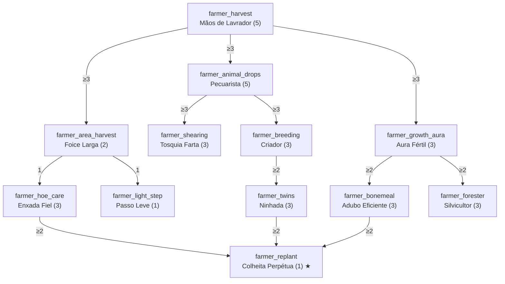

# Classe: Produtor/Fazendeiro — Agricultura e Pecuária

- **`treeCategory`:** `farmer`
- **Identidade:** quem sustenta a base. Colhe mais, colhe mais rápido, cria animais com eficiência e faz as plantas crescerem ao redor.

## Diagrama

## Nós

### Raiz

| ID | Nome | Efeito por nível | Max | Pré-requisitos |
|---|---|---|---|---|
| `farmer_harvest` | Mãos de Lavrador | 10% de chance de uma planta madura dropar +1 produto (trigo, cenoura, batata, beterraba, verruga do Nether) | 5 | — |

### Ramo Colheita

| ID | Nome | Efeito por nível | Max | Pré-requisitos |
|---|---|---|---|---|
| `farmer_area_harvest` | Foice Larga | Colher com enxada uma planta madura colhe também as maduras adjacentes. Nível 1: cruz (5 blocos). Nível 2: 3×3. | 2 | `farmer_harvest` ≥ 3 |
| `farmer_hoe_care` | Enxada Fiel | 15% de chance de a enxada não perder durabilidade | 3 | `farmer_area_harvest` ≥ 1 |
| `farmer_light_step` | Passo Leve | Pisar/pular em terra arada não a transforma em terra | 1 | `farmer_area_harvest` ≥ 1 |

### Ramo Pecuária

| ID | Nome | Efeito por nível | Max | Pré-requisitos |
|---|---|---|---|---|
| `farmer_animal_drops` | Pecuarista | 10% de chance de drop extra (couro, carne, lã, penas, coelho) ao abater animal de criação | 5 | `farmer_harvest` ≥ 3 |
| `farmer_shearing` | Tosquia Farta | 15% de chance de +1 lã ao tosquiar | 3 | `farmer_animal_drops` ≥ 3 |
| `farmer_breeding` | Criador | −15% no tempo de espera para reproduzir de novo (padrão: 5 min) | 3 | `farmer_animal_drops` ≥ 3 |
| `farmer_twins` | Ninhada | 5% de chance de nascer um filhote extra | 3 | `farmer_breeding` ≥ 2 |

### Ramo Cultivo

| ID | Nome | Efeito por nível | Max | Pré-requisitos |
|---|---|---|---|---|
| `farmer_growth_aura` | Aura Fértil | A cada 5 s, cada planta num raio de 3/4/5 blocos tem 5% de chance de avançar 1 estágio | 3 | `farmer_harvest` ≥ 3 |
| `farmer_bonemeal` | Adubo Eficiente | 15% de chance de a farinha de osso não ser consumida | 3 | `farmer_growth_aura` ≥ 2 |
| `farmer_forester` | Silvicultor | +10% de chance de muda e maçã extras ao quebrar folhas; a Aura Fértil passa a afetar mudas, cana, cacto e bambu | 3 | `farmer_growth_aura` ≥ 2 |

### Capstone

| ID | Nome | Efeito | Max | Pré-requisitos |
|---|---|---|---|---|
| `farmer_replant` | Colheita Perpétua ★ | Toda colheita com enxada (inclusive a da Foice Larga) replanta automaticamente, usando uma semente do próprio drop | 1 | `farmer_hoe_care` ≥ 2, `farmer_twins` ≥ 2, `farmer_bonemeal` ≥ 2 |

## Custo e balanceamento

| Ramo | PT |
|---|---|
| Raiz | 5 |
| Colheita | 6 |
| Pecuária | 14 |
| Cultivo | 9 |
| Capstone | 1 |
| **Total** | **35 PT = 175 níveis de XP** |

**Riscos e decisões:**
- **Aura Fértil + AFK:** o jogador parado no meio da plantação vira um acelerador permanente. Mitigações sugeridas (escolher uma): (a) só funciona se o jogador se moveu nos últimos 60 s; (b) limite de N plantas afetadas por pulso; (c) não funciona em chunks com fazendas automáticas (difícil de detectar, não recomendado). Recomendo **(a) + (b)**.
- **Performance da aura:** raio 5 = até 11×11×(altura) blocos a cada 5 s. Varrer só a camada Y−1 a Y+1 do jogador e distribuir a checagem entre ticks.
- **Foice Larga só com enxada:** evita conflito com quebrar plantações sem querer usando outras ferramentas e dá função à enxada no vanilla.
- **Mãos de Lavrador + Fortuna:** a enxada com Fortuna já aumenta drops de cultivo. O bônus do mod é uma rolagem separada depois da Fortuna; total esperado continua moderado.
- **Ninhada:** checar o limite de entidades do chunk antes de gerar o filhote extra, para não alimentar lag em fazendas grandes.
- **Pecuarista e fazendas automáticas:** só conta se o golpe final foi do jogador (não lava/afogamento), o que já é o padrão para drops com Pilhagem.
- **Fora de escopo por enquanto:** pesca e apicultura. Se quiser mais um ramo no futuro, pesca é o candidato natural.
