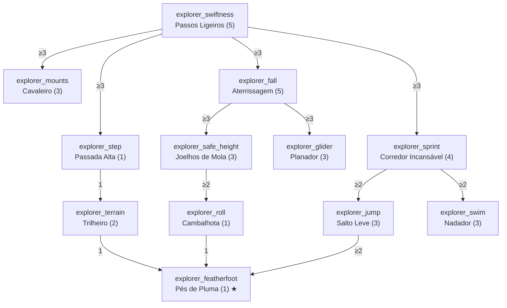

# Classe: Desbravador — Exploração e Mobilidade

- **`treeCategory`:** `explorer`
- **Identidade:** quem vive na estrada. Anda mais rápido, cai sem medo, gasta menos comida e atravessa qualquer terreno.
- **Exclusividade:** velocidade de movimento e redução de queda **não existem** na Árvore Comum; são o núcleo desta classe.

## Diagrama

## Nós

### Raiz

| ID | Nome | Efeito por nível | Max | Pré-requisitos |
|---|---|---|---|---|
| `explorer_swiftness` | Passos Ligeiros | +3% de velocidade de movimento (atributo `MOVEMENT_SPEED`, multiplicativo) | 5 | — |

### Ramo Passos

| ID | Nome | Efeito por nível | Max | Pré-requisitos |
|---|---|---|---|---|
| `explorer_step` | Passada Alta | Sobe degraus de 1 bloco sem pular. Desativado enquanto agachado. | 1 | `explorer_swiftness` ≥ 3 |
| `explorer_terrain` | Trilheiro | −25% da lentidão de areia/solo das almas, neve fofa, mel e frutas doces | 2 | `explorer_step` = 1 |
| `explorer_mounts` | Cavaleiro | +5% de velocidade da montaria (cavalo, burro, mula, camelo) | 3 | `explorer_swiftness` ≥ 3 |

### Ramo Quedas

| ID | Nome | Efeito por nível | Max | Pré-requisitos |
|---|---|---|---|---|
| `explorer_fall` | Aterrissagem | −10% de dano de queda | 5 | `explorer_swiftness` ≥ 3 |
| `explorer_safe_height` | Joelhos de Mola | +1 bloco de altura de queda sem dano (vanilla: 3) | 3 | `explorer_fall` ≥ 3 |
| `explorer_roll` | Cambalhota | Aterrissar agachado reduz mais 20% do dano de queda restante | 1 | `explorer_safe_height` ≥ 2 |
| `explorer_glider` | Planador | −15% de durabilidade gasta pela élitra | 3 | `explorer_fall` ≥ 3 |

### Ramo Fôlego

| ID | Nome | Efeito por nível | Max | Pré-requisitos |
|---|---|---|---|---|
| `explorer_sprint` | Corredor Incansável | −15% de exaustão ao correr | 4 | `explorer_swiftness` ≥ 3 |
| `explorer_jump` | Salto Leve | −20% de exaustão ao pular (inclusive correndo) | 3 | `explorer_sprint` ≥ 2 |
| `explorer_swim` | Nadador | +10% de velocidade nadando | 3 | `explorer_sprint` ≥ 2 |

### Capstone

| ID | Nome | Efeito | Max | Pré-requisitos |
|---|---|---|---|---|
| `explorer_featherfoot` | Pés de Pluma ★ | Quedas de até 12 blocos não causam dano. Acima disso, o dano é calculado a partir do 13º bloco, com as reduções normais. | 1 | `explorer_terrain` ≥ 1, `explorer_roll` = 1, `explorer_jump` ≥ 2 |

## Custo e balanceamento

| Ramo | PT |
|---|---|
| Raiz | 5 |
| Passos | 6 |
| Quedas | 12 |
| Fôlego | 10 |
| Capstone | 1 |
| **Total** | **34 PT = 170 níveis de XP** |

**Riscos e decisões:**
- **Imunidade a queda (risco principal):** a pilha completa é Pés de Pluma (12 blocos) + Aterrissagem (−50%) + Cambalhota (−20%) + Peso-Pena IV + Proteção. Exemplo, queda de 40 blocos com Peso-Pena IV: vanilla ≈ 37 de dano → ~19 com o encantamento. Com o mod: 40 − 12 = 28 de dano base → Peso-Pena ≈ 14,6 → Aterrissagem ×0,5 ≈ 7,3 → Cambalhota ×0,8 ≈ **6 de dano**. Ainda não é imunidade, o que é o objetivo. **Teto proposto:** a redução percentual do mod (Aterrissagem + Cambalhota) nunca passa de 60%, e Joelhos de Mola é ignorado quando Pés de Pluma está ativo (não somar alturas).
- **Velocidade +15%:** fica perto de Velocidade I (+20%) permanente. Somado a Pressa da Alma e poções, aplicar como `ADD_MULTIPLIED_TOTAL` para não explodir. Não deve afetar o FOV de forma exagerada; verificar a sensação no cliente.
- **Passada Alta:** muda bastante a sensação de jogo (pode atrapalhar parkour e construção). Por isso desativa agachado; considerar também uma opção no config do cliente.
- **Corredor Incansável a −60%:** correr gasta 0,1 de exaustão por metro (andar não gasta nada); com −60% cai para 0,04 por metro. Combinado com `common_saturation`, a fome do Desbravador fica muito lenta, o que é a promessa do GDD ("redução drástica"). Monitorar se a comida deixa de importar.
- **Planador:** com Inquebrável III, a élitra já dura muito; −45% adicional é qualidade de vida, não poder. Baixa prioridade de implementação.
