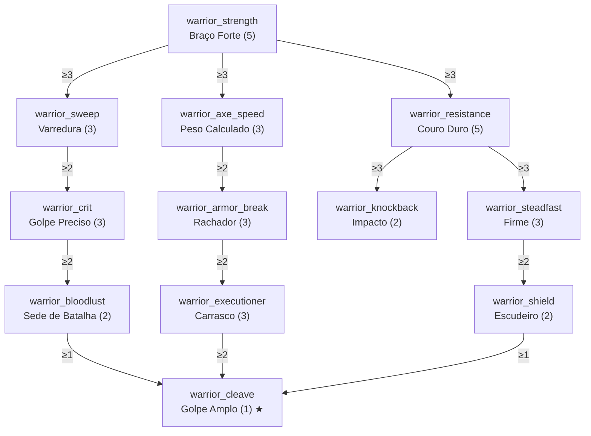

# Classe: Guerreiro — Combate Corpo a Corpo

- **`treeCategory`:** `warrior`
- **Identidade:** quem resolve de perto. Bate mais forte com espada e machado, aguenta mais e controla o espaço com repulsão.
- **Itens do GDD cobertos:** dano direto com espadas/machados (`warrior_strength`), repulsão natural (`warrior_knockback`) e resistência passiva (`warrior_resistance`).

## Diagrama

## Nós

### Raiz

| ID | Nome | Efeito por nível | Max | Pré-requisitos |
|---|---|---|---|---|
| `warrior_strength` | Braço Forte | +0,5 de dano corpo a corpo com espadas e machados | 5 | — |

### Ramo Lâmina (espada)

| ID | Nome | Efeito por nível | Max | Pré-requisitos |
|---|---|---|---|---|
| `warrior_sweep` | Varredura | +15% de dano do ataque de varredura da espada | 3 | `warrior_strength` ≥ 3 |
| `warrior_crit` | Golpe Preciso | +10% de dano em acertos críticos (vanilla: ×1,5) | 3 | `warrior_sweep` ≥ 2 |
| `warrior_bloodlust` | Sede de Batalha | Abater um mob hostil com espada cura 1 de vida (meio coração). Recarga de 2 s. | 2 | `warrior_crit` ≥ 2 |

### Ramo Machado

| ID | Nome | Efeito por nível | Max | Pré-requisitos |
|---|---|---|---|---|
| `warrior_axe_speed` | Peso Calculado | +5% de velocidade de ataque com machado | 3 | `warrior_strength` ≥ 3 |
| `warrior_armor_break` | Rachador | Ataques com machado ignoram 5% da armadura do alvo | 3 | `warrior_axe_speed` ≥ 2 |
| `warrior_executioner` | Carrasco | +10% de dano contra alvos com menos de 30% da vida | 3 | `warrior_armor_break` ≥ 2 |

### Ramo Baluarte

| ID | Nome | Efeito por nível | Max | Pré-requisitos |
|---|---|---|---|---|
| `warrior_resistance` | Couro Duro | −4% de dano físico recebido (corpo a corpo e projéteis) | 5 | `warrior_strength` ≥ 3 |
| `warrior_knockback` | Impacto | Repulsão natural: nível 1 = metade de Repulsão I; nível 2 = Repulsão I. Não soma além de Repulsão II. | 2 | `warrior_resistance` ≥ 3 |
| `warrior_steadfast` | Firme | +10% de resistência a repulsão | 3 | `warrior_resistance` ≥ 3 |
| `warrior_shield` | Escudeiro | −25% do tempo que o escudo fica desativado após golpe de machado | 2 | `warrior_steadfast` ≥ 2 |

### Capstone

| ID | Nome | Efeito | Max | Pré-requisitos |
|---|---|---|---|---|
| `warrior_cleave` | Golpe Amplo ★ | Ataques com machado totalmente carregados causam 40% do dano a até 3 inimigos hostis num raio de 1,5 bloco do alvo | 1 | `warrior_bloodlust` ≥ 1, `warrior_executioner` ≥ 2, `warrior_shield` ≥ 1 |

## Custo e balanceamento

| Ramo | PT |
|---|---|
| Raiz | 5 |
| Lâmina | 8 |
| Machado | 9 |
| Baluarte | 12 |
| Capstone | 1 |
| **Total** | **35 PT = 175 níveis de XP** |

**Riscos e decisões:**
- **Dano por ponto:** o GDD dá como exemplo "+1 de dano por ponto". Com 5 pontos seriam +5, mais que Afiação V (+3), o que deixaria uma espada de netherite com Afiação V ~45% mais forte (11 → 16). Proposta: **+0,5 por ponto** (total +2,5), abaixo de Afiação V. Se o Guerreiro parecer fraco no playtest, subir para +0,6.
- **Couro Duro (−20%) + Proteção IV:** Proteção IV em todas as peças já dá 64% de redução (teto de EPF = 80%). Aplicando o mod multiplicativamente depois: 1 − 0,36 × 0,80 ≈ **71%**, contra 64% sem o mod. Ganho perceptível sem chegar à imortalidade. **Não** aplicar a dano de fogo, queda, magia, Wither ou void (isso é da Árvore Comum/Desbravador).
- **Repulsão natural:** pode atrapalhar (empurrar creepers e esqueletos para longe, mobs fugindo). Por isso o teto é Repulsão I, e o nó tem só 2 níveis. Considerar desativar a repulsão do nó enquanto o jogador está agachado.
- **Golpe Amplo:** não afeta jogadores, animais domesticados, aldeões nem golens; não encadeia (o dano extra não dispara outro Golpe Amplo, Carrasco nem Sede de Batalha).
- **Rachador:** como é % da armadura do alvo, é forte contra mobs com armadura (zumbis e piglins brutos) e irrelevante contra a maioria; é intencional.
- **PvP:** todos os valores foram pensados para PvE. Em servidores, Couro Duro + Firme podem pesar; considerar um multiplicador de PvP no config.
