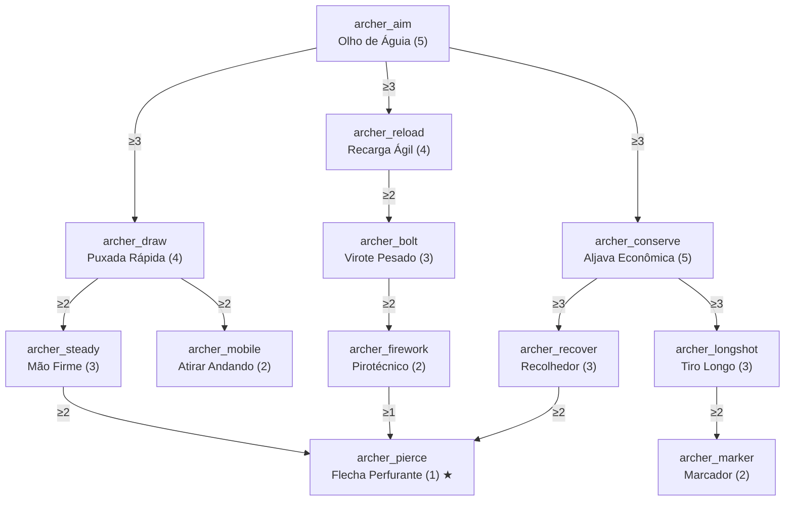

# Classe: Arqueiro — Combate à Distância

- **`treeCategory`:** `archer`
- **Identidade:** quem resolve de longe. Puxa o arco mais rápido, recarrega a besta mais rápido, acerta mais forte e economiza flechas.
- **Itens do GDD cobertos:** velocidade de puxada/recarga (`archer_draw`, `archer_reload`), dano extra em projéteis (`archer_aim`) e chance de não consumir flecha (`archer_conserve`).

## Diagrama

## Nós

### Raiz

| ID | Nome | Efeito por nível | Max | Pré-requisitos |
|---|---|---|---|---|
| `archer_aim` | Olho de Águia | +4% de dano de flechas e tridentes arremessados | 5 | — |

### Ramo Arco

| ID | Nome | Efeito por nível | Max | Pré-requisitos |
|---|---|---|---|---|
| `archer_draw` | Puxada Rápida | −6% do tempo para carga total do arco (vanilla: 1 s) | 4 | `archer_aim` ≥ 3 |
| `archer_steady` | Mão Firme | −20% de dispersão das flechas de arco | 3 | `archer_draw` ≥ 2 |
| `archer_mobile` | Atirar Andando | −25% da lentidão de movimento enquanto puxa o arco | 2 | `archer_draw` ≥ 2 |

### Ramo Besta

| ID | Nome | Efeito por nível | Max | Pré-requisitos |
|---|---|---|---|---|
| `archer_reload` | Recarga Ágil | −8% do tempo de recarga da besta (vanilla: 1,25 s) | 4 | `archer_aim` ≥ 3 |
| `archer_bolt` | Virote Pesado | +8% de dano de flechas disparadas por besta | 3 | `archer_reload` ≥ 2 |
| `archer_firework` | Pirotécnico | +10% de dano de foguetes disparados por besta | 2 | `archer_bolt` ≥ 2 |

### Ramo Munição

| ID | Nome | Efeito por nível | Max | Pré-requisitos |
|---|---|---|---|---|
| `archer_conserve` | Aljava Econômica | 8% de chance de não consumir a flecha (inclui flechas com efeito e espectrais) | 5 | `archer_aim` ≥ 3 |
| `archer_recover` | Recolhedor | Flechas que acertam um mob têm 20% de chance de cair no chão ao matá-lo | 3 | `archer_conserve` ≥ 3 |
| `archer_longshot` | Tiro Longo | +10% de dano quando o alvo está a mais de 20 blocos | 3 | `archer_conserve` ≥ 3 |
| `archer_marker` | Marcador | Flechas que acertam aplicam Brilho no alvo por 2 s | 2 | `archer_longshot` ≥ 2 |

### Capstone

| ID | Nome | Efeito | Max | Pré-requisitos |
|---|---|---|---|---|
| `archer_pierce` | Flecha Perfurante ★ | Flechas de arco com carga total atravessam 1 alvo adicional (como Perfuração I), causando 70% do dano no segundo alvo | 1 | `archer_steady` ≥ 2, `archer_firework` ≥ 1, `archer_recover` ≥ 2 |

## Custo e balanceamento

| Ramo | PT |
|---|---|
| Raiz | 5 |
| Arco | 9 |
| Besta | 9 |
| Munição | 13 |
| Capstone | 1 |
| **Total** | **37 PT = 185 níveis de XP** |

**Riscos e decisões:**
- **Aljava Econômica vs. Infinidade:** com Infinidade, flechas normais já não são consumidas; o nó passa a valer para flechas com efeito e espectrais, que é justamente onde ele importa. Em 40%, flechas com efeito duram ~1,7× mais. Aceitável; se ficar forte, excluir flechas com efeito acima do nível 3.
- **Besta quase instantânea:** Carga Rápida III já reduz a recarga para 0,5 s (1,25 − 0,75). Com −32% do mod, ficaria ~0,34 s. **Teto proposto:** recarga mínima de 0,4 s (8 ticks), qualquer que seja a combinação.
- **Dano empilhado:** Olho de Águia (+20%), Virote Pesado (+24%) e Tiro Longo (+30%) aplicados juntos e multiplicativos dão ~1,9× em tiros longos de besta. Com Força V, isso fica alto. Proposta: somar os bônus percentuais do Arqueiro de forma **aditiva entre si** (+74% no máximo) e só depois multiplicar pelo dano vanilla.
- **Tridentes:** incluídos no Olho de Águia porque são projéteis; não incluídos no restante (Puxada Rápida, Aljava etc.). Bolas de neve, ovos e poções arremessadas ficam de fora.
- **Flecha Perfurante + Perfuração:** se a besta tiver Perfuração, o capstone não se aplica a ela (o capstone é só para arco, para dar ao arco algo que a besta já tem).
- **Recolhedor:** só funciona com flechas que poderiam ser recolhidas (não as de Infinidade nem as disparadas no modo criativo), para não duplicar flechas.
- **Tiro Longo:** medir a distância entre o ponto de disparo e o alvo no impacto, não a distância percorrida pela flecha.
